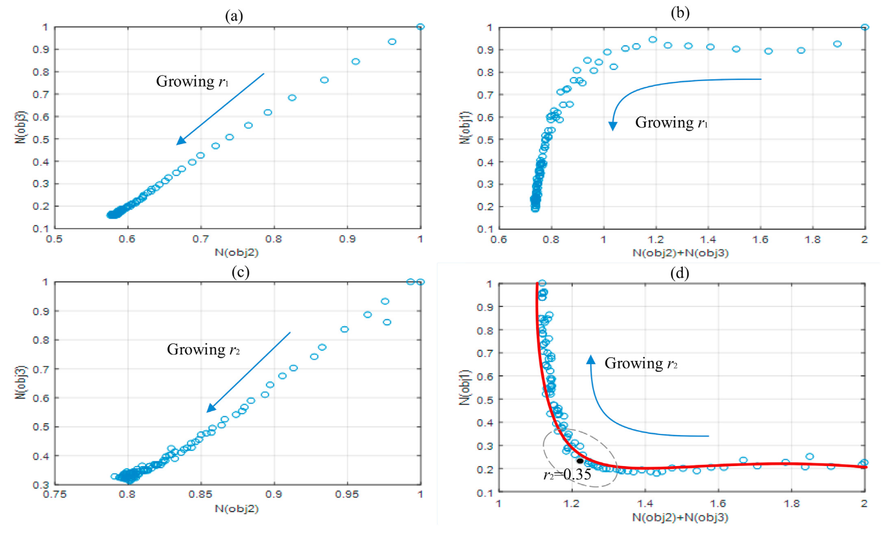

# APC controller of WF based on DMPC

## Single turbine modeling

### Nonlinear accurate model

$$P_m=0.5\pi\rho R^2C_p(\lambda,\beta)v^3,\ F_t=\frac{P_m}{v}$$

Drive system of the WT is composed of rotating parts and transmission parts.
$$\begin{cases}
    J_{\mathrm{m}}\dot{\omega}_{\mathrm{r}}=T_{m}-T_{s} \\
    T_{\mathrm{s}}=K_{\mathrm{sp}}\psi+K_{\mathrm{vi}}\dot{\psi} \\
    J_{\mathrm{e}}\dot{\omega}_{\mathrm{e}}=\frac{T_{s}}{N_{\mathrm{gear}}}-T_{e} & & & 
\end{cases}$$
Generator model and pitch angle servo system can be both regarded as first-order inertia models.
$$
\begin{cases}
    T_e+\tau_e\dot{T}_e=T_e^{ref}\\
    P_e=\mu\omega_e T_e\\
    \dot{\beta}=\frac{1}{\tau_{\beta}}(\beta^{ref}-\beta)
\end{cases}
$$

Tower's overall load can be modelled by bending moment. i.e. $M_t=hF_t$.

### Linear model of wind turbine

From small-signal method, we can obtain the linearization of $T_m$: $T_m=T_m(\omega_r,v,\beta),\Delta T_m=\frac{\partial T_m}{\partial\omega_r}\Delta\omega_r+\frac{\partial T_m}{\partial v}\Delta v+\frac{\partial T_m}{\partial\beta}\Delta\beta$...

Linearized input and output:
$$
\boldsymbol{x}=\begin{bmatrix}
    \Delta\omega_r&\Delta\omega_e&\Delta\psi&\Delta T_e&\Delta\beta
\end{bmatrix}^T,\boldsymbol{y}=\begin{bmatrix}
    \Delta P_e&\Delta M_t&\Delta T_s
\end{bmatrix}^T \\
\boldsymbol{u}=\begin{bmatrix}
    \Delta T_e^{ref}&\Delta\beta^{ref}
\end{bmatrix}^T, d=\Delta v
$$

## Wake effect modeling

Considering the model precision and usability, we choose PyWake Python package developed by DTU.

## Predictive Model

### Discretized model:

$$
\begin{cases}
    x(k+1)=A_dx(k)+B_du+E_dd\\
    y(k+1)=C_dx(k)+D_du+W_dd
\end{cases}
$$

### Optimizer model:

1. Local optimizer
   test1.
2. __Global optimizer(ADMM...)__
   - Global objective function and constriants.
    $$\min\sum_{i=1}^{N_\mathrm{t}}\sum_{j=1}^{N_\mathrm{c}}\left\{\left\|y_i\left(k+j\right|k\right)-y_i^\mathrm{ref}\right\|_{\mathcal{Q}_{y,i}}^2+\|u_i(k+j-1|k)\|_{\mathcal{Q}_{u,i}}^2$$

    $$\begin{cases} \sum_{j=1}^{N_{\mathrm{c}}}\left(\Delta P_{\mathrm{wf}}^{\mathrm{ref}}(k+j|k)-\sum_{i=1}^{N_{\mathrm{t}}}\Delta P_{\mathrm{e},i}(k+j|k)\right)=0 \\ \Delta P_{\mathrm{e},i}^{\mathrm{min}}\leq\Delta P_{\mathrm{e},i}\leq\Delta P_{\mathrm{e},i}^{\mathrm{max}} \\ 0\leq\left|\Delta M_{\mathrm{t},i}\right|\leq\Delta M_{\mathrm{t},i}^{\mathrm{max}} \\ 0\leq\left|\Delta T_{\mathrm{s}}\right|\leq\Delta T_{\mathrm{s},i}^{\mathrm{max}} \\ \Delta T_{\mathrm{e},i}^{\mathrm{min}}\leq\Delta T_{\mathrm{e},i}\leq\Delta T_{\mathrm{e},i}^{\mathrm{max}} \\ \Delta\beta_{i}^{\mathrm{min}}\leq\Delta\beta_{i}\leq\Delta\beta_{i}^{\mathrm{max}} & & & \end{cases}$$
   - Weight matrix update approaches.
    use 3 objective functions to perform simulations and plot graphs...
    
   - Augmented Lagrangian form of the optim problem
    $$
    \begin{aligned}
    \mathcal{L}_{i,(\sigma,\eta)}(u,z,\mu,\lambda)=&u_i^TH_iu_i+f_i^Tu_i+\gamma\|z_i\|^2 \\
    & 
    +\mu_i^T(Py_i-\Delta P_i^{ref}+z_i)+\lambda_i^T(A_{c,i}u_i-b_i+t_i) \\
    &
    +\frac{\sigma}{2}\|A_{c,i}u_i-b_i+t_i\|^2+\frac{\eta}{2}\|Py_i-\Delta P_i^{ref}+z_i\|^2
    \end{aligned}
    $$
   - Solution of ADMM Lagrangian
    admm
   - test

